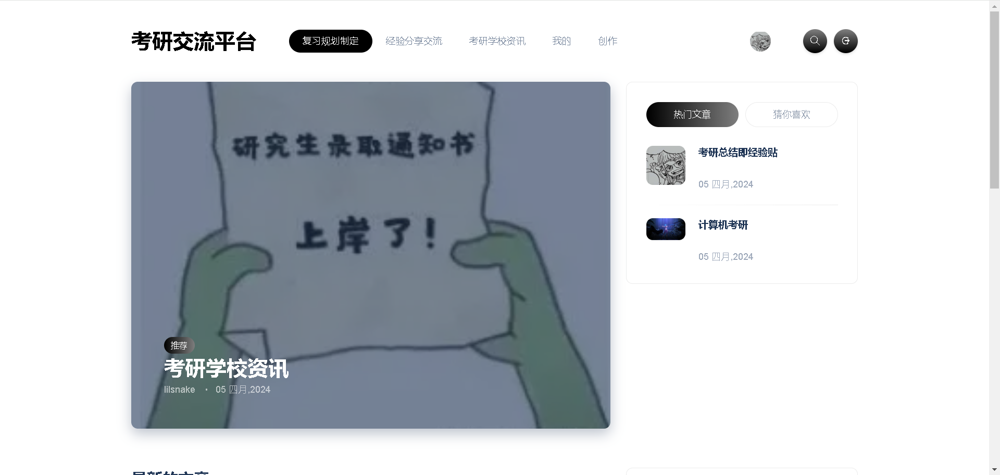
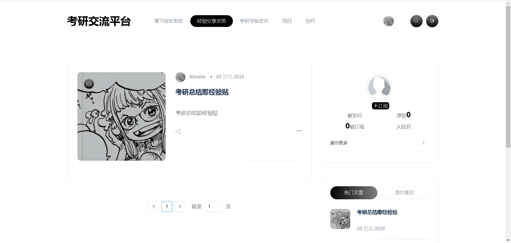
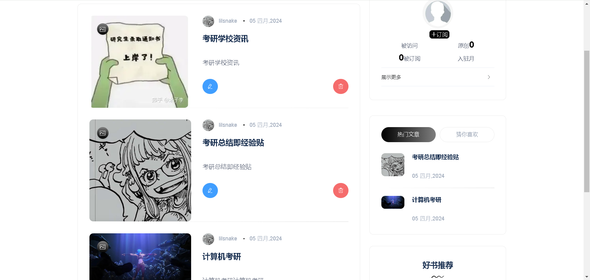
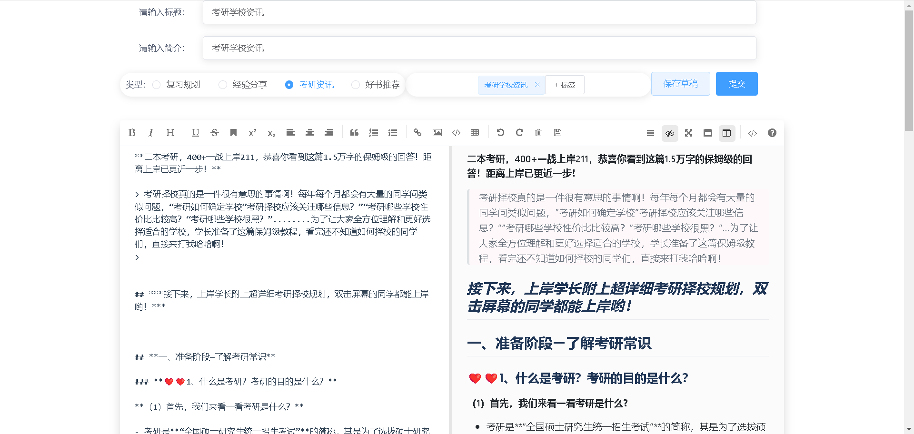
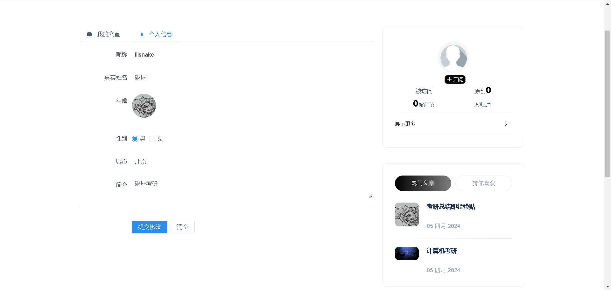
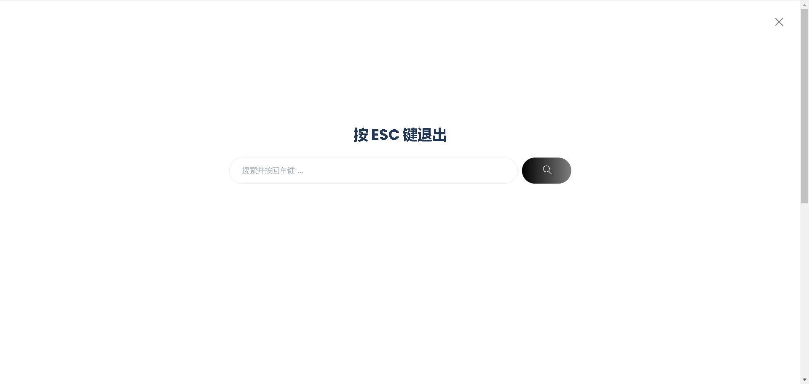
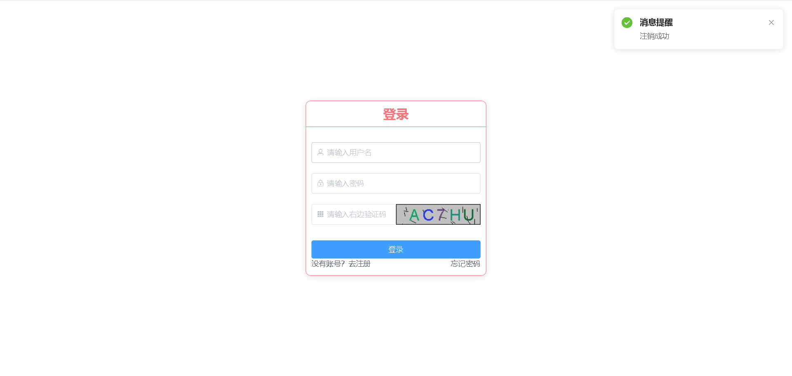
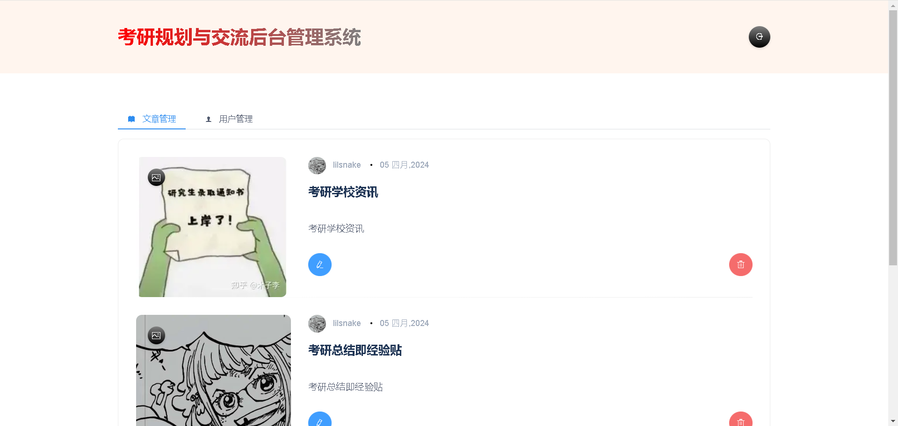
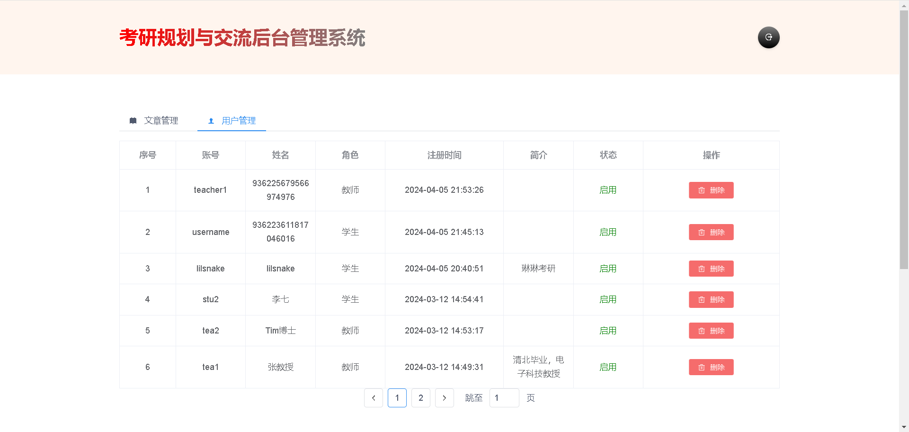

# springboot+redis+vue2考研交流论坛系统前端
### 考研交流管理系统，前台+后台，需要后端+sql源码/部署联系v：13172202452

### 基于springboot的考研平台系统

关于本项目
本项目为本科毕业设计主要有以下功能：

2、管理员在后台将文章推送到前台的不同板块

3、用户在前台浏览、评论和收藏文章

4、其他相关功能如用户管理。

开发环境与工具
运行环境：Tomcat 9、Java8

框架：springboot、vue2、redis、elementui

数据库：MySQL8.0

开发工具：IDEA、Maven、Git  


## 安装依赖
```
npm install
```

## 启动项目
```
npm run dev
```



















